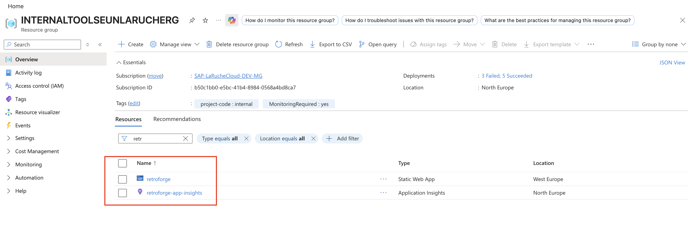
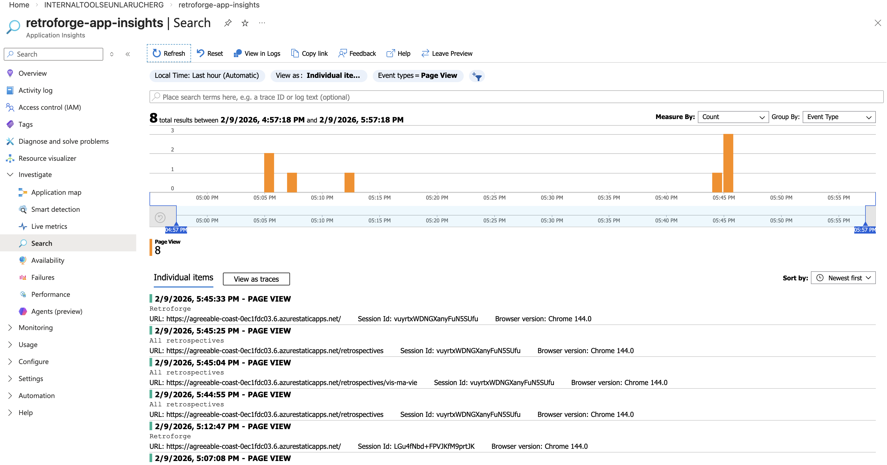

# Retroforge


> Build a retrospective tailored to your needs!

Retroforge is an interactive web application that helps agile teams discover and select the most suitable retrospective format for their needs. Using two engaging modes—**Hammer Swipe** (swipe-based) and **Deep Anvil** (question-based)—teams can quickly match with retrospective formats that fit their current situation.

## Features

- **🔨 Hammer Swipe Mode**: Tinder-style swipe interface to quickly browse and select retrospectives
- **⚒️ Deep Anvil Mode**: Answer targeted questions to get personalized retrospective recommendations
- **🌐 Multilingual**: Full support for English and French
- **📱 Responsive Design**: Works seamlessly on desktop, tablet, and mobile devices
- **🎨 Modern UI**: Built with TailwindCSS 4 and Framer Motion for smooth animations
- **📊 Retrospective Matching**: Smart algorithm that scores and recommends retrospectives based on your answers

## Tech Stack

- **Frontend Framework**: React 19 + React Router v7
- **Language**: TypeScript 5.8
- **Styling**: TailwindCSS 4
- **Animations**: Framer Motion
- **Internationalization**: i18next + react-i18next
- **Build Tool**: Vite
- **Package Manager**: Yarn 4.7.0
- **Monitoring**: Microsoft Application Insights

## Azure Deployment

Retroforge is deployed as an **Azure Static Web App** with the following resources:



### Azure Resources

**Subscription**: SAP-LaRucheCloud-DEV-MG
**Resource Group**: INTERNALTOOLSEUNLARUCHERG

The deployment includes two resources:

1. **retroforge** - Static Web App hosting the application
2. **retroforge-app-insights** - Application Insights instance for tracking metrics and telemetry

### Application Insights

Application Insights is integrated to track:
- Page views and user interactions
- Performance metrics
- Custom telemetry events

To view metrics:
1. Navigate to the `retroforge-app-insights` resource in Azure Portal
2. Go to **Investigate** → **Search**
3. Apply filters to analyze user behavior and performance



### Network Security

Access to the application is restricted to authorized networks only. The `staticwebapp.config.json` file contains IP range configurations that allow access exclusively from:
- Office network
- VPN connections

This ensures the application is only accessible to internal team members.

## CI/CD Pipeline

The project uses **GitHub Actions** for continuous integration and deployment.

### Workflow

- **Trigger**: Automatic deployment on push to the `main` branch
- **Build**: Application is built using React Router build system
- **Deploy**: Automatically deployed to Azure Static Web Apps
- **Pull Requests**: Preview deployments for PRs, automatically closed when PR is merged

The GitHub Actions workflow is defined in `.github/workflows/azure-static-web-apps-agreeable-coast-0ec1fdc03.yml`.

### Deployment Process

```
Push to main → GitHub Actions → Build → Deploy to Azure → Live!
```

## Getting Started

### Prerequisites

- Node.js (v18 or higher recommended)
- Yarn 4.7.0

### Installation

```bash
# Install dependencies
yarn install
```

### Development

```bash
# Start development server
yarn dev
```

The application will be available at `http://localhost:5173` (or the port shown in the console).

### Building

```bash
# Build for production
yarn build
```

The built files will be in the `build/` directory.

### Type Checking

```bash
# Run TypeScript type checking
yarn typecheck
```

### Linting

```bash
# Run ESLint
yarn lint
```

## Project Structure

```
retroforge/
├── app/
│   ├── common/              # Shared components, types, and utilities
│   │   ├── assets/         # Static assets and locales
│   │   ├── components/     # Reusable components
│   │   ├── computations/   # Business logic and algorithms
│   │   ├── context/        # React context providers
│   │   ├── hooks/          # Custom React hooks
│   │   ├── types/          # TypeScript type definitions
│   │   └── ui/             # UI component library
│   ├── deep-anvil/         # Deep Anvil mode components
│   ├── hammer-swipe/       # Hammer Swipe mode components
│   ├── layouts/            # Layout components
│   ├── retrospectives/     # Retrospective listing and details
│   └── routes/             # Route components
├── docs/                   # Documentation and screenshots
├── .github/
│   └── workflows/          # GitHub Actions CI/CD
├── staticwebapp.config.json # Azure Static Web App configuration
└── package.json
```

## How It Works

1. **Home Screen**: Users choose between Hammer Swipe or Deep Anvil mode
2. **Answer Questions**: Users interact with questions about their team's situation
3. **Matching Algorithm**: The app calculates scores for retrospectives based on answers
4. **Results**: Users see a ranked list of recommended retrospectives
5. **Browse All**: Users can explore all available retrospectives

## Contributing

1. Create a feature branch from `main`
2. Make your changes
3. Ensure tests pass and linting is clean
4. Create a pull request to `main`
5. Once approved and merged, changes are automatically deployed

## License

Internal tool for SAP LaRucheCloud team.

## Support

For issues or questions, please contact the internal development team.
